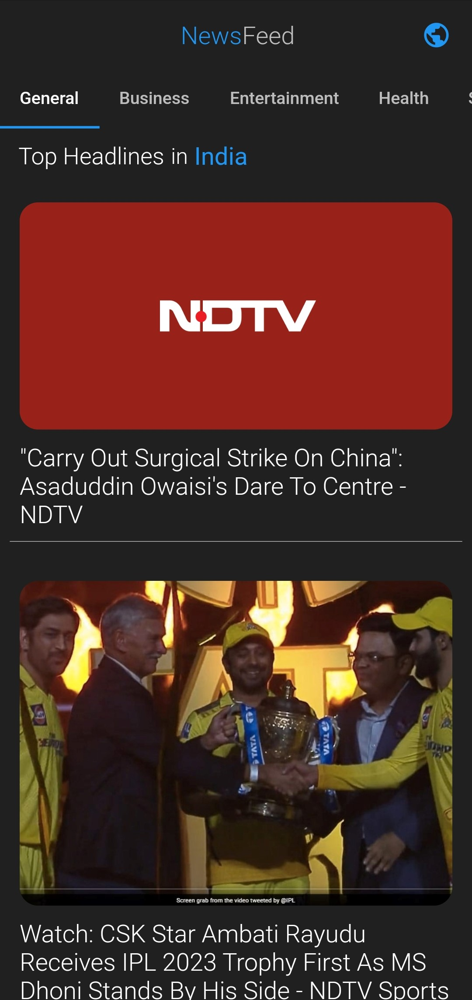
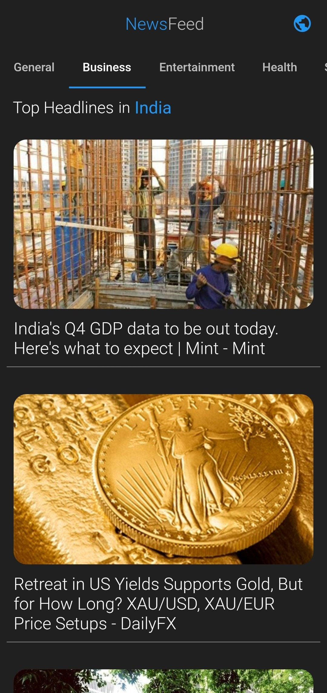

<h1 align="center">
NewsFeed
</h1>

<h6 align='right'><a href = 'https://github.com/nishanth1000/NewsFeed-NewsApp-FlutterApp/releases/download/v0.1.0/NewsFeed.apk'>Download the App </a></h6>

• A Mobile Application designed to deliver news content. 
• A single app which can deliver all the news content across 54 countries. 
• Displays the news article using the url specified for the news.

## Features
• News content across 54 countries. 
• Quick change of news content between countries. 
• News contents are subcategorized into <b>General, Business, Entertainment, Health, Science, Sports, Technology</b>. 
• By default the country is set to India to display news content. 
• API: NewsAPI 

## Screenshots
#### Fetching Data from API
<pre>
 
</pre>

#### Sub Categories : General, Business, Entertainment, Health, Science, Sports, Technology
<pre>
      
</pre>

#### Countries List (54 Countries)
<pre>
     
</pre>

#### Each Countries News Content in their Official Language
<pre>
    
</pre>

#### Displaying News Article
<pre>
  
</pre>
